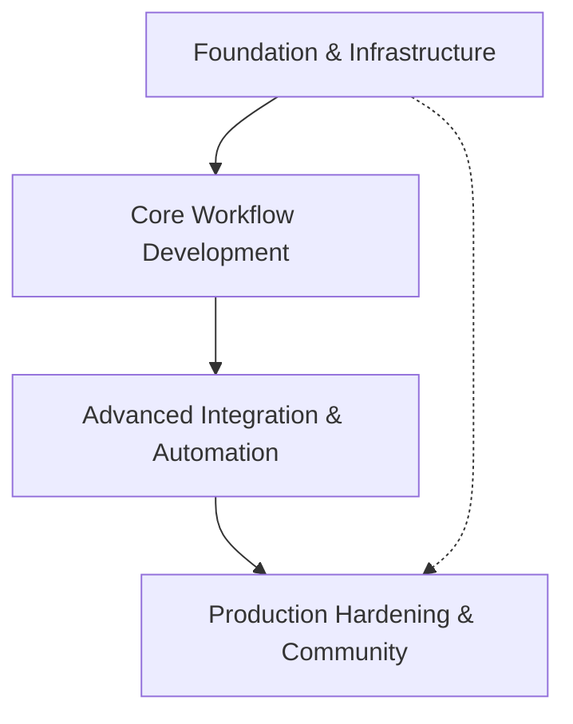

# Project Roadmap: AI Tools Workflow Integration Platform

**Last Updated**: 2025-05-26

## 1. Overall Project Vision & Goals
*   Create seamless integration workflows between Figma (design), Stitch (data), Replit (cloud development), and Google AI Studio (AI models)
*   Enable automated design-to-deployment pipelines with AI-powered optimization
*   Establish reusable patterns for cross-platform AI tool integration
*   Build comprehensive documentation and examples for community adoption

## 2. Major Project Phases / Epics

### Phase/Epic 1: Foundation & Infrastructure
*   **Description**: Establish core MCP infrastructure, API integrations, and basic connectivity across all four platforms
*   **Status**: In Progress (Architecture Phase)
*   **Key Objectives**:
    *   Complete MCP server configuration and health monitoring
    *   Establish authenticated API access to all four platforms
    *   Create basic integration testing framework
    *   Document core architecture and module interfaces
*   **Primary HDTA Links**: 
    *   `mcp_infrastructure_module.md` - Server management and connectivity
    *   `figma_integration_module.md` - Design platform API access
*   **Notes/Key Deliverables for this Phase/Epic**:
    *   Working MCP server infrastructure with 15+ configured servers
    *   Authenticated Figma API access with token management
    *   Basic health monitoring and error handling systems

### Phase/Epic 2: Core Workflow Development
*   **Description**: Build fundamental workflows for design-to-code, data pipeline automation, and AI-powered development assistance
*   **Status**: Initial Planning
*   **Key Objectives**:
    *   Implement Figma design asset extraction and component analysis
    *   Create Stitch data pipeline templates and automation
    *   Develop Google AI Studio code generation workflows
    *   Build Replit deployment and collaboration systems
*   **Primary HDTA Links**: 
    *   `workflow_orchestration_module.md` - Cross-platform coordination
    *   `ai_integration_module.md` - AI model integration and code generation
*   **Notes/Key Deliverables for this Phase/Epic**:
    *   Working design-to-code pipeline prototypes
    *   Automated data flow between all four platforms
    *   AI-powered code generation and optimization tools

### Phase/Epic 3: Advanced Integration & Automation
*   **Description**: Implement sophisticated workflow automation, real-time collaboration, and AI-driven optimization across the entire platform
*   **Status**: Not Started
*   **Key Objectives**:
    *   Create end-to-end automated deployment pipelines
    *   Implement real-time design-development synchronization
    *   Build AI-powered workflow optimization and recommendation systems
    *   Establish comprehensive monitoring and analytics dashboards
*   **Primary HDTA Links**: 
    *   `data_pipeline_module.md` - Advanced analytics and insights
    *   `cloud_development_module.md` - Collaborative development workflows
*   **Notes/Key Deliverables for this Phase/Epic**:
    *   Fully automated design-to-deployment workflows
    *   Real-time collaboration features across all platforms
    *   AI-driven workflow optimization and performance analytics

### Phase/Epic 4: Production Hardening & Community
*   **Description**: Prepare the platform for production use, create comprehensive documentation, and build community adoption resources
*   **Status**: Not Started
*   **Key Objectives**:
    *   Implement enterprise-grade security and access controls
    *   Create comprehensive user documentation and tutorials
    *   Build template library and community examples
    *   Establish support and maintenance workflows
*   **Primary HDTA Links**: 
    *   TBD - Security and access control implementations
    *   TBD - Documentation and community resource modules
*   **Notes/Key Deliverables for this Phase/Epic**:
    *   Production-ready platform with security hardening
    *   Complete documentation and tutorial library
    *   Community templates and integration examples

## 3. High-Level Inter-Phase/Epic Dependencies

## 4. Key Project-Wide Milestones
*   **MCP Infrastructure Complete**: All 15+ servers configured and monitored - Status: In Progress
*   **First Working Workflow**: End-to-end design-to-code pipeline operational - Status: Planned
*   **AI Integration Functional**: Google AI Studio code generation workflows active - Status: Planned  
*   **Multi-Platform Sync**: Real-time synchronization between all four platforms - Status: Planned
*   **Community Launch**: Public documentation and examples available - Status: Planned

## 5. Overall Project Notes / Strategic Considerations
*   Focus on stress-testing initial workflow assumptions to identify and address weak points early
*   Prioritize modular architecture to enable independent development and testing of each platform integration
*   Maintain comprehensive documentation throughout development for community adoption
*   Emphasize security and authentication from the foundation phase to avoid technical debt